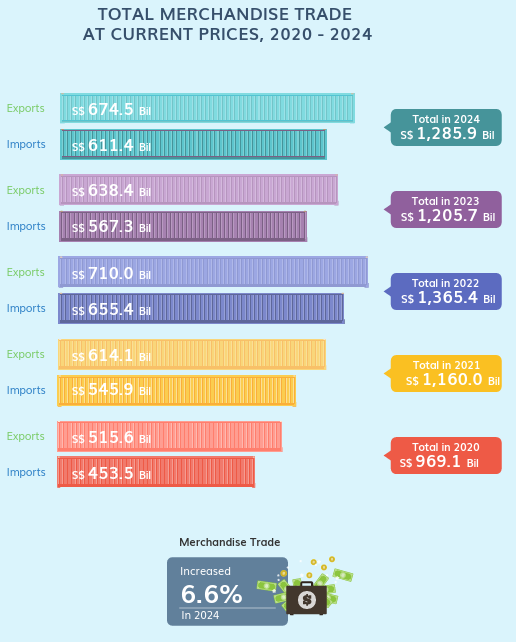
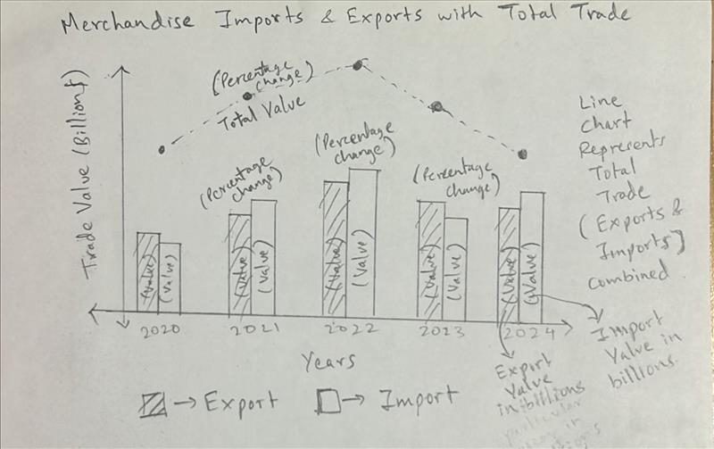
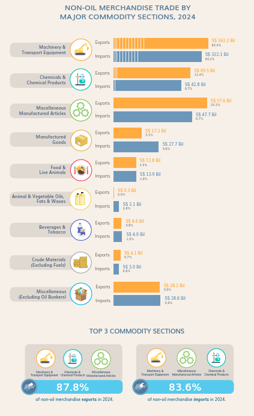
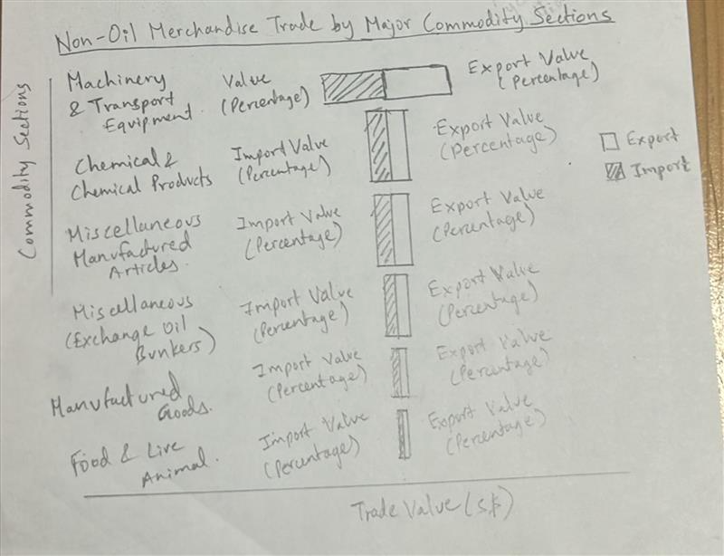
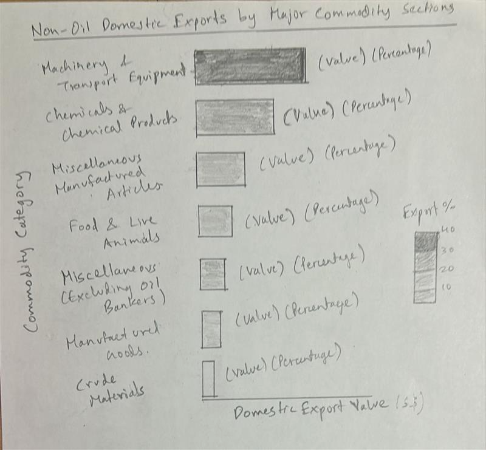

# Take-home Exercise 2: Be Tradewise or Otherwise

# 1. Introduction

## 1.1 Background

As a visual analytics novice, I am eager to apply newly acquired techniques to explore and analyze the changing trends and patterns of Singapore’s international trade.

## 1.2 Objectives

The objectives of this assignment is to:

-   Select three Visualizations from the Department of Statistics Singapore - International trade website and comment on the pros and cons of the visualization.

-   To provide a better Visualization based on the critique using appropriate ggplot2 packages.

-   Analyse the data with either time-series analysis or time-series forecasting methods by compliment the analysis with appropriate data visualization methods and R packages.

# 2. Getting Started

## 2.1 Setting the Analytical Tools

```{r}
pacman::p_load(tidyverse, readr, forecast, lubridate, fable, feasts, tsibble)
```

1)  Tidyverse - Tidyverse is an R programming package that helps to transform and better present data. It assists with data import, tidying, manipulation, and data visualization.
2)  readr - The goal of 'readr' is to provide a fast and friendly way to read rectangular data (like 'csv', 'tsv', and 'fwf'). It is designed to flexibly parse many types of data found in the wild, while still cleanly failing when data unexpectedly changes.
3)  forecast - Methods and tools for displaying and analysing univariate time series forecasts including exponential smoothing via state space models and automatic ARIMA modelling.
4)  lubridate - Functions to work with date-times and time-spans: fast and user friendly parsing of date-time data, extraction and updating of components of a date-time (years, months, days, hours, minutes, and seconds), algebraic manipulation on date-time and time-span objects.
5)  fable - Provides a collection of commonly used univariate and multivariate time series forecasting models including automatically selected exponential smoothing (ETS) and autoregressive integrated moving average (ARIMA) models.
6)  feasts - Provides a collection of features, decomposition methods, statistical summaries and graphics functions for the analysing tidy time series data.
7)  tsibble - Provides a 'tbl_ts' class (the 'tsibble') for temporal data in an data- and model-oriented format. The 'tsibble' provides tools to easily manipulate and analyse temporal data, such as filling in time gaps and aggregating over calendar periods.

## 2.2 Data Source

The data is Merchandise Trade by Region/Market from Department of Statistics Singapore, DOS website For this analysis, I am using four datasets - For Data Visualization Makeover I am using - Merchandise Trade By Commodity Section, (At Current Prices), Monthly csv and for Analysis I am using three datasets combined - Merchandise Trade By Region and Selected Market (Imports), Monthly Merchandise Trade By Region and Selected Market (Domestic Exports), Monthly Merchandise Trade By Region and Selected Market (Re-Exports), Monthly

# 3. Data Visualisation Makeover

## 3.1. Load Dataset

```{r}
Current_Prices <- read_csv("data/Current_Prices.csv")
```

## 3.2 Check missing values

```{r}
# Missing values check
sum(is.na(Current_Prices))
```

## 3.3 Chart 1 - Merchandise Imports and Exports with Total Trade

### 3.1.1 Original Visualization



### 3.1.2 Critique

#### Pros

-   Clear and Organized Layout: The data is well-structured, and the imports and exports for each year are shown in a way that makes them easy to see.
-   Effective Use of Colors: It is simple to distinguish between time periods when different colors are used for each year.
-   Comparison Made Easy: Exports and imports are shown side by side, making it easy to compare different years.
-   Summarized Totals: Each year's total merchandise trade is shown, which makes it simple to understand the general pattern.
-   Growth Highlighted: To assist viewers grasp the general trend, the growth in trade (6.6% in 2024) is specifically noted.
-   Text that is Legible and Easy to Read: The values are given in an understandable manner.

#### Cons

-   No Percentage Change Per Year: Although 2024's 6.6% increase is noted, comparable percentage changes for previous years are not included.
-   Color Overlap Risk: People who are colorblind may find it challenging to distinguish between certain hues, such as tones of blue and purple.
-   Percentages of exports and import between years can be included for comparison.
-   Line chart can be used for total trade value and percentages instead of it being just a label next to the bar charts

### 3.1.3 Sketch of Alternative Design



### 3.1.4 Improved Visualization

```{r}
#| plot-height: 20
#| plot-width: 60
#| code-fold: true

library(tidyverse)

# Converting column names to characters for proper handling
colnames(Current_Prices) <- as.character(colnames(Current_Prices))

# Identifying year columns that have a valid numeric format
year_columns <- names(Current_Prices)[sapply(Current_Prices, is.numeric)]

# Ensuring the first column (Data Series) is included
year_columns <- c("Data Series", year_columns)

# Reshaping data into long format
current_prices_long <- Current_Prices %>% 
  select(all_of(year_columns)) %>%
  pivot_longer(cols = -`Data Series`, names_to = "Year", values_to = "Value") %>%
  mutate(Year = str_extract(Year, "\\d{4}"), Value = as.numeric(Value)) %>%
  filter(!is.na(Year) & Year >= 2020 & Year <= 2024) %>%
  group_by(Year, `Data Series`) %>%
  summarise(Total = sum(Value, na.rm = TRUE)) %>%
  ungroup()

# Selecting relevant trade categories
selected_categories <- c(
  "Total Merchandise Imports, (At Current Prices)", 
  "Total Merchandise Exports, (At Current Prices)",
  "Total Merchandise Trade, (At Current Prices)"
)
current_prices_filtered <- current_prices_long %>% 
  filter(`Data Series` %in% selected_categories)

# Calculating percentage change
current_prices_filtered <- current_prices_filtered %>% 
  arrange(Year, `Data Series`) %>% 
  group_by(`Data Series`) %>%
  mutate(Percentage_Change = (Total - lag(Total)) / lag(Total) * 100) %>%
  ungroup()

# Removing NA from Percentage Change for 2020 since it's the first year in the visualization
current_prices_filtered <- current_prices_filtered %>%
  mutate(Percentage_Change = ifelse(is.na(Percentage_Change), "", paste0(round(Percentage_Change, 1), "%")))

# Separating Total Trade for Line Chart
total_trade <- current_prices_filtered %>% filter(`Data Series` == "Total Merchandise Trade, (At Current Prices)")
imports_exports <- current_prices_filtered %>% filter(`Data Series` != "Total Merchandise Trade, (At Current Prices)")

# Adjusting position for overlapping labels
offset <- 0.05 * max(imports_exports$Total)

# Plotting the improved visualization
ggplot() +
  # Bar chart for Imports and Exports
  geom_bar(data = imports_exports, aes(x = Year, y = Total, fill = `Data Series`), 
           stat = "identity", position = position_dodge(width = 0.8), color = "black") +
  # Value labels inside bars, slightly separated for clarity
  geom_text(data = imports_exports, aes(x = Year, y = Total * 0.7, label = paste0(round(Total/1e9, 1), "B"), group = `Data Series`), 
            position = position_dodge(width = 0.8), vjust = 1.5, size = 5, color = "white", fontface = "bold") +
  # Percentage labels outside bars
  geom_text(data = imports_exports, aes(x = Year, y = Total + offset, label = Percentage_Change, group = `Data Series`), 
            position = position_dodge(width = 0.8), vjust = -0.5, color = "black", size = 5, fontface = "bold") +
  # Line chart for Total Merchandise Trade
  geom_line(data = total_trade, aes(x = Year, y = Total, group = 1), color = "grey50", size = 1.2, linetype = "dashed") +
  geom_point(data = total_trade, aes(x = Year, y = Total), color = "black", size = 3) +
  # Value labels for Total Merchandise Trade
  geom_text(data = total_trade, aes(x = Year, y = Total - offset, label = paste0(round(Total/1e9, 1), "B")), 
            vjust = 1.5, size = 5, color = "black", fontface = "bold") +
  # Percentage labels for Total Merchandise Trade
  geom_text(data = total_trade, aes(x = Year, y = Total + offset * 1.5, label = Percentage_Change), 
            vjust = -0.5, size = 5, color = "black", fontface = "bold") +
  # Custom colors and legend improvements
  scale_fill_manual(values = c("#E69F00", "#56B4E9"), 
                    labels = c("Total Merchandise Exports (At Current Prices) - Includes percentage change",
                               "Total Merchandise Imports (At Current Prices) - Includes percentage change")) +
  guides(fill = guide_legend(title = "Trade Type & Details")) +
  # Labels and theme
  labs(title = "Merchandise Imports & Exports with Total Trade Overlay (2020-2024)",
       subtitle = "At Current Prices, Percentage Change Included",
       x = "Year",
       y = "Trade Value (Billion S$)") +
  theme_minimal() +
  theme(plot.margin = margin(5, 5, 5, 5),
        legend.position = "bottom", 
        axis.text.x = element_text(angle = 45, hjust = 1))
```

The visualization provides a complete examination of Singapore's goods Imports & Exports from 2020 to 2024, exhibiting trade variations, percentage changes, and total goods trade patterns. The grouped bar chart highlights annual import and export data, while the dashed line chart overlays total trade performance, presenting a holistic view. Both imports and exports showed robust growth between 2020 and 2022, with imports increasing by 20.4% in 2021 and 20.1% in 2022 and exports increasing by 19.1% in 2021 and 15.6% in 2022. However, 2023 saw a decline in both imports (-13.4%) and exports (-10.1%), signaling a potential slowdown due to global economic uncertainties. Following a sharp decline of 11.7% in 2023, the total trade volume showed a modest recovery of 6.6% in 2024, indicating gradual market stabilization, after peaking at S\$1.4 billion in 2022 (17.7% growth). The clear distinction between imports, exports, and total trade trends makes trade patterns easy to interpret, with white trade value labels inside the bars for quick readability and percentage change labels positioned above bars and the line chart for year-over-year comparisons. Overall, this visualization effectively captures trade dynamics, economic recovery trends, and external market impacts, showing a strong post-2020 rebound, a notable dip in 2023, and a steady yet cautious recovery in 2024, reflecting Singapore’s resilience in international trade.

## 3.4 Chart 2 - Non-Oil Merchandise Trade by Major Commodity Sections, 2024

### 3.4.1 Original Visualization



### 3.4.2 Critique

#### Pros

-   Equitable Export and Import Representation: Exports and imports can be directly compared using the diverging bar chart format, which makes it simple to spot trade imbalances for every commodity category.

-   Included in the Percentage Composition: Each category's contribution to the overall non-oil merchandise trade is contextualized by the chart, which shows both absolute trade values and percentage shares.

-   Unambiguous Commodity Dissection: The largest trade categories can be easily identified thanks to the chart's descending order of first three commodity division.

-   X-Axis Adjusted for Proportionality: The x-axis extends sufficiently to accommodate large trade categories like Machinery & Transport Equipment, preventing distortion.

-   Trade Type Color Coding: It is simple to differentiate between the two trade categories because imports and exports are colored differently (blue and orange, respectively).

-   Label Positioning for Readability Properly: Legibility is improved by the export and import values being positioned clearly with their corresponding bars.

#### Cons

-   Smaller Categories Overcrowded: Smaller trade sectors (such as Beverages & Tobacco, Animal & Vegetable Oils) seem crowded and make comparisons challenging, even though the main categories are easily accessible.

-   Subtitle can be written for better context of the graph

-   Contrast of Import and Export: A clearer contrast of imports and exports can be compared by placing side by side instead of top and bottom

-   On the scale, machinery and transport equipment are dominant: Because Machinery & Transport Equipment accounts for 65% of exports and 65.2% of imports, however these percentage values are very small in the actual chart making it non-visible at start

### 3.4.3 Sketch of Alternative Design



### 3.4.4 Improved Visualization

Lets prep data to extract only non-oil columns of import and export

```{r}
#| code-fold: true

# Column names are treated as characters
colnames(Current_Prices) <- as.character(colnames(Current_Prices))

# Identifying columns for 2024 (all months)
columns_2024 <- grep("2024", colnames(Current_Prices), value = TRUE)

# Selecting relevant rows for Non-Oil Imports (rows 19-27) and Non-Oil Exports (rows 33-41)
non_oil_imports <- Current_Prices[19:27, c("Data Series", columns_2024)]
non_oil_exports <- Current_Prices[33:41, c("Data Series", columns_2024)]

# Renaming the 'Data Series' column for clarity
colnames(non_oil_imports)[1] <- "Commodity Section"
colnames(non_oil_exports)[1] <- "Commodity Section"

# Converting all columns except 'Commodity Section' to numeric
non_oil_imports[columns_2024] <- lapply(non_oil_imports[columns_2024], as.numeric)
non_oil_exports[columns_2024] <- lapply(non_oil_exports[columns_2024], as.numeric)

# Aggregating the sum for all months in 2024
non_oil_imports <- non_oil_imports %>% 
  mutate(`Imports (S$)` = rowSums(across(all_of(columns_2024)), na.rm = TRUE)) %>%
  select("Commodity Section", "Imports (S$)")

non_oil_exports <- non_oil_exports %>% 
  mutate(`Exports (S$)` = rowSums(across(all_of(columns_2024)), na.rm = TRUE)) %>%
  select("Commodity Section", "Exports (S$)")

# Merging imports and exports data
non_oil_trade <- merge(non_oil_exports, non_oil_imports, by = "Commodity Section")
```

Now that the data is prepared below is the code for the improved visualization

```{r}
#| code-fold: true

library(tidyverse)

# Calculating percentage composition
total_exports <- sum(non_oil_trade$`Exports (S$)`, na.rm = TRUE)
total_imports <- sum(non_oil_trade$`Imports (S$)`, na.rm = TRUE)
non_oil_trade <- non_oil_trade %>%
  mutate(`Export Share (%)` = (`Exports (S$)` / total_exports) * 100,
         `Import Share (%)` = (`Imports (S$)` / total_imports) * 100)

# Adjusting plot width for readability
ggplot(non_oil_trade, aes(y = reorder(`Commodity Section`, `Exports (S$)`))) +
  geom_bar(aes(x = `Exports (S$)`, fill = "Exports"), 
           stat = "identity", position = "dodge", color = "black") +
  geom_bar(aes(x = -`Imports (S$)`, fill = "Imports"), 
           stat = "identity", position = "dodge", color = "black") +
  geom_text(aes(x = `Exports (S$)`, label = paste0("S$ ", formatC(`Exports (S$)`, format = "d", big.mark = ","), " (", round(`Export Share (%)`, 1), "%)")), 
            hjust = -0.3, size = 3) +
  geom_text(aes(x = -`Imports (S$)`, label = paste0("S$ ", formatC(`Imports (S$)`, format = "d", big.mark = ","), " (", round(`Import Share (%)`, 1), "%)")), 
            hjust = 1.3, size = 3) +
  scale_x_continuous(limits = c(-max(non_oil_trade$`Imports (S$)`) * 2.5, max(non_oil_trade$`Exports (S$)`) * 2.5)) +
  scale_fill_manual(values = c("Exports" = "#FFA500", "Imports" = "#4682B4")) +
  labs(title = "Non-Oil Merchandise Trade by Major Commodity Sections, 2024",
       subtitle = "Exports and Imports (S$) with Percentage Composition",
       x = "Trade Value (S$)",
       y = "Commodity Sections",
       fill = "Trade Type") +
  theme_minimal() +
  theme(plot.margin = margin(5, 5, 5, 5))
```

Machinery and Transport Equipment leads trade, making up 65.2% of imports (S\$ 322.07 billion) and 65% of exports (S\$ 363.22 billion), according to the Non-Oil Merchandise Trade by Major Commodity Sections report for 2024. This suggests a strong dependence on imported machinery, most likely for local industrial use or re-export, making it the most traded category. With 8.7% of imports and 12.4% of exports, Chemicals & Chemical Products come in second, indicating that although Singapore imports chemicals for industrial use, it also exports a lot of goods related to chemical manufacturing. Similar to this, Miscellaneous Manufactured Articles make up 10.3% of exports and 9.7% of imports, indicating a reasonably balanced trade that may be fueled by industrial and consumer goods. Singapore imports more than it exports in other industries, such as manufactured goods (5.8% imports, 5% exports) and food and live animals (5.6% imports, 3.1% exports), indicating that domestic demand outpaces production in these areas. With contributions of less than 1% to global commerce, beverages and tobacco, crude materials (apart from fuels), and animal and vegetable oils, fats, and waxes all contribute very little to trade-driven economic activity.

## 3.5 Chart 3 - Non-Oil Domestic Exports by Major Commodity Sections, 2024

### 3.5.1 Original Visualization


### 3.5.2 Critique

#### Pros

-   Engaging Design: The chart's ship-themed design makes it visually appealing while successfully communicating trade flow.

-   The Top 3 Sectors Featured: It is simpler to identify important drivers because the top three categories—Machinery & Transport Equipment, Chemicals & Chemical Products, and Miscellaneous Manufactured Articles—are highlighted.

-   Clear Total Value: A clear feeling of size is immediately provided by the conspicuous representation of the total non-oil domestic exports, which amount S\$ 173.6 billion.

-   Category Breakdown: Users may better grasp the contributions of various sectors thanks to the clear labeling of each key commodity area, which includes trade values and percentages.

-   Color coding: Enhances differentiation by assigning distinct colors to each category.

#### Cons

-   Comparing export data across different categories is challenging due to the ship-based layout's lack of a uniform axis.

-   Space Restrictions: Some labels and values, especially for categories with lower export values, are small and challenging to read.

-   No Clear Rankings: It is more difficult to rapidly determine the trade distribution in this chart since it does not explicitly rank the categories in descending order.

-   More emphasis on design than Visualization as the space of birds and sea occupy more space and the percentages are indicated very small compared to the whole graph.

### 3.5.3 Sketch of Alternative Design



### 3.5.4 Improved Visualization

```{r}
#| code-fold: true

# Ensuring column names are treated as characters
colnames(Current_Prices) <- as.character(colnames(Current_Prices))

# Identifying 2024 columns
columns_2024 <- grep("2024", colnames(Current_Prices), value = TRUE)

# Selecting rows for Non-Oil Domestic Exports (rows 47-55)
domestic_exports <- Current_Prices[47:55, c("Data Series", columns_2024)]

# Renaming column for clarity
colnames(domestic_exports)[1] <- "Commodity Category"

# Converting all columns except 'Commodity Category' to numeric
domestic_exports[columns_2024] <- lapply(domestic_exports[columns_2024], as.numeric)

# Aggregating sum for all months in 2024
domestic_exports <- domestic_exports %>%
  mutate(`Domestic Export Value (S$)` = rowSums(across(all_of(columns_2024)), na.rm = TRUE)) %>%
  select(`Commodity Category`, `Domestic Export Value (S$)`)

# Calculating percentage composition
total_domestic_exports <- sum(domestic_exports$`Domestic Export Value (S$)`, na.rm = TRUE)
domestic_exports <- domestic_exports %>%
  mutate(`Domestic Export Share (%)` = (`Domestic Export Value (S$)` / total_domestic_exports) * 100)

# Sorting data in descending order
domestic_exports <- domestic_exports %>% arrange(desc(`Domestic Export Value (S$)`))

# Extending x-axis for clarity and use a color gradient for better contrast
ggplot(domestic_exports, aes(x = `Domestic Export Value (S$)`, y = reorder(`Commodity Category`, `Domestic Export Value (S$)`), fill = `Domestic Export Share (%)`)) +
  geom_bar(stat = "identity", color = "black") +
  geom_text(aes(label = paste0("S$ ", formatC(`Domestic Export Value (S$)`, format = "d", big.mark = ","), " (", round(`Domestic Export Share (%)`, 1), "%)")), 
            hjust = -0.1, size = 5) +
  scale_x_continuous(limits = c(0, max(domestic_exports$`Domestic Export Value (S$)`) * 2)) +
  scale_fill_gradient(low = "#2E86C1", high = "#FF0000") +
  labs(title = "Non-Oil Domestic Exports by Major Commodity Sections, 2024",
       subtitle = "Export Value (S$) and Percentage Composition",
       x = "Domestic Export Value (S$)",
       y = "Commodity Category",
       fill = "Export Share (%)") +
  theme_minimal() +
  theme(plot.margin = margin(10, 10, 10, 10))
```

Machinery & Transport Equipment dominates the Non-Oil Domestic Exports by Major Commodity Sections in 2024, accounting for 40.5% of all domestic exports (S\$ 70.38 million). This implies that high-value manufacturing and reexports of machinery-related commodities play a significant part in Singapore's economy, reflecting its status as a global center for trade in industrial and technology goods.

Miscellaneous Manufactured Articles accounts for 16.5% (S\$ 28.64 million), while Chemicals & Chemical Products make up 25.6% (S\$ 44.44 million). These industries show robust domestic production capacities in high-value manufactured goods and chemical processing, which are probably fueled by Singapore's sophisticated industrial infrastructure and well-thought-out trade laws.

In comparison to industrial exports, Singapore is less dependent on other sectors, as evidenced by the small contributions made by Food & Live Animals (6.6%), Miscellaneous (Excluding Oil Bunkers) (6.1%), and Manufactured Goods (2.9%) to domestic exports. Animal & Vegetable Oils, Fats & Waxes (0.1%), Beverages & Tobacco (0.1%), and Crude Materials (1.5%) make up small percentages of total exports, confirming that the majority of Singapore's domestic exports are driven by industry and technology rather than natural resources.

# 4. Data Wrangling - Part 4

## 4.1 Importing Data

```{r}
Imports <- read_csv("data/Imports_Monthly.csv")
```

```{r}
Exports <- read_csv("data/Domestic_Exports_Monthly.csv")
```

```{r}
ReExports <- read_csv("data/ReExports_Monthly.csv")
```

## 4.2 Data Preparation

### 4.2.1 Check missing values

```{r}
# Missing values check
sum(is.na(Imports))
sum(is.na(Exports))
sum(is.na(ReExports))
```

There is no missing values in all the three datasets

### 4.2.2 Columnname change

```{r}
# First column changed to 'Market_Region' instead of Data Series for better context
colnames(ReExports)[1] <- "Market_Region"
colnames(Exports)[1] <- "Market_Region"
colnames(Imports)[1] <- "Market_Region"
```

### 4.2.3 Convert to Long Format

```{r}
#| code-fold: true

# From wide to long format conversion
ReExports_long <- ReExports %>%
  pivot_longer(cols = -Market_Region,  # Market_Region column excluded
               names_to = "Date",
               values_to = "ReExports")

Exports_long <- Exports %>%
  pivot_longer(cols = -Market_Region, 
               names_to = "Date",
               values_to = "Domestic_Exports")

Imports_long <- Imports %>%
  pivot_longer(cols = -Market_Region, 
               names_to = "Date",
               values_to = "Imports")
```

The new datasets now only have three columns Market_Region, Date and number values of export, imports or reexports.

### 4.2.4 Converting Data format

```{r}
#| code-fold: true

# Function to convert chr "YYYY Mon" to date "DD-MM-YYYY" of the new long format data
date_format <- function(df) {
  df <- df %>%
    mutate(
      Date = trimws(Date),  # Removing any leading or trailing spaces
      Month_Abbrev = word(Date, 2),  # Extracting month abbreviation
      Year = word(Date, 1),  # Extracting year
      Month_Num = match(Month_Abbrev, month.abb),  # To numeric month
      Date = as.Date(paste0("01-", Month_Num, "-", Year), format = "%d-%m-%Y")  # To proper date, 01 added for date character
    ) %>%
    select(-Month_Abbrev, -Month_Num, -Year)  # Removing helper columns
  
  return(df)
}

ReExports_long <- date_format(ReExports_long)
Exports_long <- date_format(Exports_long)
Imports_long <- date_format(Imports_long)
```

### 4.2.5 Checking missing values in long format

```{r}
# Missing values check
sum(is.na(Imports_long))
sum(is.na(Exports_long))
sum(is.na(ReExports_long))
```

There is are no missing values to handle in the long format datasets.

### 4.2.6 Dataset Merge

```{r}
# All three datasets merged by Market_Region and Date
trade_data <- full_join(ReExports_long, Exports_long, by = c("Market_Region", "Date")) %>%
  full_join(Imports_long, by = c("Market_Region", "Date"))
```

New merged data is the combination of all three long format datasets.

### 4.2.7 Check duplicates on merged dataset

```{r}
sum(duplicated(trade_data))
```

There are no duplicates in the new merged dataset.

# 5. Part 4: Time-series Visualisation

```{r}
#| code-fold: true

# Filtering for Total All Markets only
trade_data <- trade_data %>% filter(Market_Region == "Total All Markets")

# Converting to tsibble
ts_tsibble <- trade_data %>%
  mutate(Date = yearmonth(`Date`)) %>%
  as_tsibble(index = `Date`)

# Visualising Time-series Data
# Converting from wide to long format
ts_longer <- trade_data %>%
  pivot_longer(cols = c(3:5),
               names_to = "Trade_Type",
               values_to = "Value") %>%
  mutate(Date = yearmonth(Date)) %>%  # Date is in yearmonth format
  as_tsibble(index = Date, key = Trade_Type)  # Converting to tsibble

# Plotting single time-series for Imports
ts_longer %>%
  filter(Trade_Type == "Imports") %>%
  ggplot(aes(x = Date, y = Value)) +
  geom_line(size = 0.5) +
  labs(title = "Imports Over Time", x = "Date", y = "Value") +
  theme_minimal()

# Plotting multiple time-series for all trade types
ggplot(ts_longer, aes(x = Date, y = Value, color = Trade_Type)) +
  geom_line(size = 0.5) +
  theme(legend.position = "bottom")

# Visual Analysis of Seasonality
# Seasonal plot
ts_longer %>%
  filter(Trade_Type %in% c("Imports", "ReExports", "Domestic_Exports")) %>%
  gg_season(Value)

# Cycle plot
ts_longer %>%
  filter(Trade_Type %in% c("Imports", "ReExports")) %>%
  gg_subseries(Value)

# Time Series Decomposition
ts_tsibble %>%
  model(stl = STL(ReExports)) %>%
  components() %>%
  autoplot()

# Visual STL Diagnostics
# Classical decomposition
ts_tsibble %>%
  model(classical_decomposition(ReExports, type = "additive")) %>%
  components() %>%
  autoplot()

# Forecasting
ts_train <- ts_tsibble %>%
  filter(Date < yearmonth("2024-01"))

# Fitting ETS model
fit_ets <- ts_train %>%
  model(ETS(ReExports))

# Forecast
forecast_ets <- fit_ets %>%
  forecast(h = "12 months")

# Plotting forecast
forecast_ets %>%
  autoplot(ts_tsibble)
```

Import Over Time (Graph 1) The import trend over time is seen in this map, which shows an upward tendency with noticeable fluctuations. Periods of high expansion, occasional drops, and recovery phases are indicative of shifts in policy, global trade disruptions, or economic cycles. With some volatility in recent years, the long-term trend points to a consistent rise in imports.

Multiple Trade Types Over Time (Graph 2) The comparison of imports, reexports, and domestic exports over time is displayed in this plot. The amount of imports (green line) is higher than that of domestic exports (red) and reexports (blue). All categories show increasing tendencies, although imports have grown at the fastest rate. The trends also suggest that trade volumes may be impacted by economic factors and seasonal cycles.

Seasonal Plot (Graph 3) This visualization groups data by month to compare trade trends over time. In order to assist viewers recognize seasonal trends, each color corresponds to a distinct year. The existence of a recurring annual pattern is confirmed by the cyclical behavior, where trade values tend to rise in some months (March for example) and fall in others.

Subseries Plot (Graph 4) The monthly fluctuations over various years are highlighted in the subseries plot. Each panel shows variations over time and relates to a particular month (January through December). The average value for each month is shown by the blue horizontal line. Seasonal trends and steady expansion in subsequent years are evident, with some months exhibiting stronger trading activity than others.

STL Decomposition (Graph 5) The ReExports time series is divided into three parts via STL decomposition: 1) Trend: Long-term growth is indicated by a steady increasing trend. 2) Seasonality: The seasonal component exhibits a recurring pattern with predictable changes occurring at predetermined periods. 3) Remainder (Residuals): This section records irregular changes and noise. Unexpected external shocks, such as policy changes or economic crises, are indicated by certain increases.

Classical Decomposition (Graph 6) This visualization divides ReExports into Trend, Seasonal, and Random components, much like the STL decomposition. The findings confirm that the data shows a long-term upward trend and strong seasonality, while the random component records unpredictable fluctuations.

Forecasting ReExports (Graph 7) The ETS model's predicted values for ReExports throughout the upcoming year are displayed in this graph. The degree of prediction uncertainty is shown by the darkened blue areas, which stand for the 80% and 95% confidence intervals. Although the prediction interval grows over time, indicating increased uncertainty, the projection indicates that ReExports will continue to rise.

# 6. Summary and Conclusion

Important insights about Singapore's patterns in merchandise trade are offered by the three visualizations. The first graph displays annual trends in total trade, imports, and exports from 2020 to 2024. In the second, non-oil merchandise trade is broken out by commodity, with the largest import and export categories being machinery and transport equipment. The third reinforces the dominance of machinery and concentrates on local exports other than oil. Improvements were made to the label's visibility, spacing, and clarity. When combined, these graphics successfully depict sectoral contributions, trade patterns, and annual trends.

Seasonal variations impact trade volumes, but the data reveals a consistent upward trend in imports, domestic exports, and reexports. While exports and reexports have comparable but lesser growth rates, imports predominate. Forecasting indicates continuous increase with some degree of uncertainty, whereas decomposition supports a strong trend and seasonal influences.

In conclusion, trade is growing as a result of market demands and economic expansion. Forecasting shows future growth but possible instability, and seasonal tendencies emphasize the necessity of strategic preparation. To maximize trade strategies, stakeholders should take global trends, regulatory changes, and market conditions into consideration.
